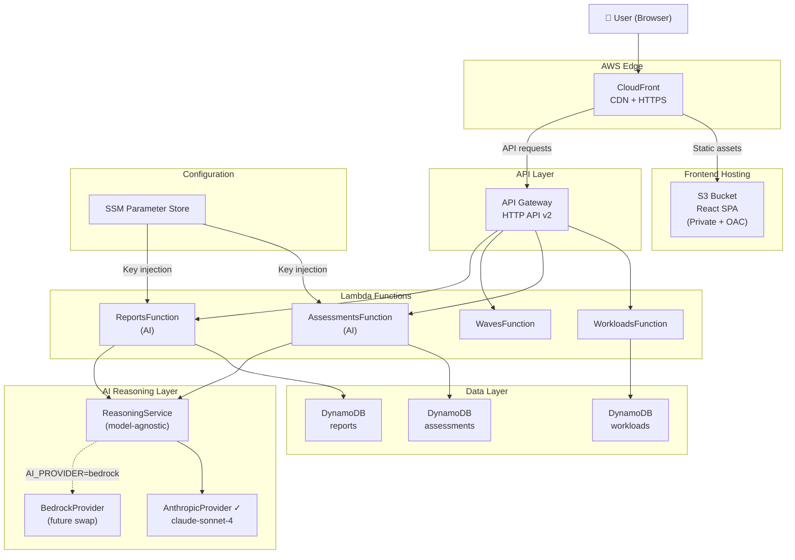

# MigrationOps

**AI-Assisted Cloud Migration Planning Platform**

An end-to-end platform for enterprise cloud transformation teams. MigrationOps uses AI to assess workloads, recommend AWS migration strategies, plan migration waves, surface risks, and generate executive-ready reports — deployed on a production serverless AWS stack.

---

## Live Demo

| | |
|---|---|
| **Frontend** | [https://d2tzxxbh5vpj3z.cloudfront.net](https://d2tzxxbh5vpj3z.cloudfront.net) |
| **API** | [https://jy39irwjc6.execute-api.us-east-1.amazonaws.com/prod/api/workloads](https://jy39irwjc6.execute-api.us-east-1.amazonaws.com/prod/api/workloads) |

> Loads with 12 pre-assessed RetailCo workloads. Portfolio readiness score: **81/100**.

---

## What It Does

| Page | Description |
|---|---|
| **Executive Dashboard** | Portfolio readiness score, strategy distribution, wave breakdown, risk heatmap |
| **Workload Intake** | Structured form capturing hosting, traffic, dependencies, compliance, criticality |
| **AI Assessment** | Per-workload strategy, target AWS architecture, risk factors, confidence score |
| **Assessment Review** | Approve or override AI recommendations — full human-in-the-loop workflow |
| **Wave Planner** | AI-sequenced Wave 1 / 2 / 3 migration plan with rationale |
| **Risk Dashboard** | High-risk flags, dependency analysis, compliance and downtime tracking |
| **Architecture Recommendations** | Target AWS architecture per workload with service breakdown |
| **Executive Report** | AI-generated leadership briefing — one click, presentation-ready |

---

## Screenshots

> *RetailCo demo — 12 enterprise workloads, fully assessed, wave-planned, and ready to present.*

### Executive Dashboard

*Portfolio readiness score, strategy distribution, wave breakdown, and risk summary.*

### AI Assessment Results

*AI-generated migration strategy, target AWS architecture, risk factors, confidence score, and reasoning — with approve/override controls.*

### Migration Wave Planner

*Three-column wave visualization with AI-sequenced workload assignments and rationale.*

### Risk Dashboard

*High-risk workload tracking, dependency flags, compliance analysis, and downtime tolerance heat map.*

### Architecture Recommendations

*Per-workload target AWS architecture with service chips and design rationale.*

### Executive Report

*AI-generated leadership briefing covering portfolio status, strategic recommendations, and migration readiness.*

---

## Tech Stack

| Layer | Technology |
|---|---|
| **Frontend** | React 18, TypeScript, Vite, Tailwind CSS, Recharts |
| **Backend** | Node.js 20, TypeScript, AWS Lambda (arm64), API Gateway HTTP API v2 |
| **Database** | DynamoDB — 3 tables, PAY_PER_REQUEST, point-in-time recovery |
| **AI** | Anthropic Claude via model-agnostic provider interface (Bedrock-ready) |
| **Infrastructure** | AWS SAM / CloudFormation, CloudFront + S3 (OAC), SSM Parameter Store, X-Ray |

---

## Architecture



---

## AI Reasoning Layer

The AI layer is built around a `AIProvider` interface that decouples all AI calls from any specific vendor — a deliberate design choice for enterprise contexts where data governance requirements often dictate which LLM a team can use.

> *"The reasoning layer is model-agnostic and can support Bedrock or third-party LLM APIs depending on governance and cost requirements."*

**Current provider:** Anthropic `claude-sonnet-4`
**Swap path to Bedrock:** implement `BedrockProvider`, set `AI_PROVIDER=bedrock`, add `bedrock:InvokeModel` IAM permission. No controller, handler, or frontend changes required.

AI is invoked for two operations:
- **Assessment** — strategy recommendation, target architecture, risk factors, confidence score, reasoning summary
- **Executive report** — portfolio narrative, wave status, strategic recommendations

---

## AWS Services

| Service | Role |
|---|---|
| **CloudFront** | Global CDN, HTTPS, SPA routing via custom error responses (403/404 → index.html) |
| **S3** | Private static hosting with Origin Access Control — no public bucket exposure |
| **API Gateway HTTP API v2** | ~70% cheaper than REST API v1; lower latency for JSON CRUD |
| **Lambda (Node.js 20, arm64)** | Four isolated functions; Graviton2 for ~20% cost reduction |
| **DynamoDB** | PAY_PER_REQUEST billing, point-in-time recovery, multi-table design |
| **SSM Parameter Store** | API key injection at runtime — no secrets in code or environment files |
| **SAM / CloudFormation** | Full infrastructure-as-code, parameterized dev/staging/prod |
| **CloudWatch + X-Ray** | Structured logging, distributed tracing, 30-day retention |

---

## Local Development

### Path A — No AWS required

In-memory store, pre-seeded RetailCo data, no credentials needed.

```bash
cd backend && cp .env.example .env   # add ANTHROPIC_API_KEY for AI features
npm install && npm run dev            # → http://localhost:3001

# separate terminal
cd frontend && npm install && npm run dev   # → http://localhost:5173
```

### Path B — DynamoDB Local

```bash
docker run -d -p 8000:8000 amazon/dynamodb-local
./infrastructure/scripts/setup-local-dynamo.sh
cd backend   # set STORAGE_BACKEND=dynamodb, DYNAMODB_ENDPOINT=http://localhost:8000
npm run seed:dynamo && npm run dev
cd frontend && npm run dev
```

### Path C — SAM Local (Lambda + API Gateway)

```bash
sam build && sam local start-api   # port 3002
cd frontend
echo "VITE_API_BASE_URL=http://localhost:3002" > .env && npm run dev
```

---

## Deployment

### Backend

```bash
aws ssm put-parameter --name /migrationops/anthropic-api-key --value "sk-ant-..." --type String
sam build && sam deploy --no-confirm-changeset
```

### Frontend

```bash
./infrastructure/scripts/deploy-frontend.sh \
  --bucket migrationops-frontend-eb-4821 \
  --distribution E1W2TYMUPQNINB \
  --api-url https://jy39irwjc6.execute-api.us-east-1.amazonaws.com/prod
```

Builds React with production env, syncs to S3 with optimized cache headers, invalidates CloudFront.

---

## Project Structure

```
migrationops/
├── template.yaml                  SAM infrastructure template
├── samconfig.toml                 SAM deployment config
├── backend/src/
│   ├── controllers/               Pure business logic — no HTTP/Lambda coupling
│   ├── handlers/                  Lambda entry points (API Gateway v2 routing)
│   ├── repositories/              Storage abstraction — memory or DynamoDB
│   ├── services/ai/               AIProvider interface + Anthropic implementation
│   └── data/                      RetailCo seed dataset + DynamoDB bootstrap
├── frontend/src/
│   ├── pages/                     7 application pages
│   ├── components/                Layout + UI components
│   └── services/api.ts            Axios API client
└── infrastructure/scripts/
    ├── deploy-frontend.sh         S3 + CloudFront deployment
    └── setup-local-dynamo.sh      DynamoDB Local table setup
```

---

## API Reference

```
GET    /api/workloads                        List all workloads
GET    /api/workloads/:id                    Get single workload
POST   /api/workloads                        Create workload
PUT    /api/workloads/:id                    Update workload
DELETE /api/workloads/:id                    Delete workload

GET    /api/assessments                      List all assessments
GET    /api/assessments/workload/:id         Get assessment for workload
POST   /api/assessments/workload/:id/run     Trigger AI assessment
PATCH  /api/assessments/:id/approve          Approve or override
DELETE /api/assessments/:id                  Delete assessment

GET    /api/waves                            Workloads grouped by wave

GET    /api/reports/metrics                  Portfolio metrics
GET    /api/reports/latest                   Most recent executive report
GET    /api/reports                          All reports
POST   /api/reports/generate                 Generate AI executive report
```

---

## RetailCo Demo Dataset

12 pre-assessed production workloads. Portfolio readiness score: **81/100**.

| Workload | Strategy | Wave | Risk |
|---|---|---|---|
| Ecommerce Platform | Replatform | Wave 2 | High |
| Payment Gateway | Refactor | Wave 3 | High |
| Product Catalog | Replatform | Wave 2 | Medium |
| Analytics Engine | Refactor | Wave 3 | Medium |
| CRM | Retain | Wave 3 | Low |
| HR System | Rehost | Wave 1 | Medium |
| ERP | Replatform | Wave 3 | High |
| Marketing Automation | Replatform | Wave 2 | Low |
| Mobile API | Rehost | Wave 1 | Low |
| Warehouse Management | Replatform | Wave 2 | Medium |
| Recommendation Engine | Refactor | Wave 3 | Medium |
| Customer Support | Retain | Wave 1 | Low |

---

## Roadmap

- [ ] Amazon Bedrock provider (`AI_PROVIDER=bedrock`)
- [ ] Multi-tenant auth with Cognito
- [ ] Dependency graph visualization
- [ ] Per-workload cost estimation via AWS Pricing API
- [ ] AWS Migration Hub integration
- [ ] PDF export for executive reports
- [ ] Bulk workload import via CSV

---

## Why This Matters

Enterprise cloud migrations fail at the planning phase — inconsistent strategy selection, poor wave sequencing, and analysis that can't keep pace with a real program. MigrationOps addresses that gap by combining structured migration methodology with AI reasoning in a workflow that stays auditable and keeps humans in control.

The model-agnostic design reflects a real enterprise constraint: governance requirements often dictate which LLM a team can use. Switching from Anthropic to Bedrock is a configuration change, not a rewrite.
